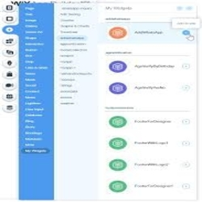

<!DOCTYPE html>
<html lang="en">
<head>
	<meta charset="utf-8">
	<meta name="viewport" content="width=device-width, initial-scale=1, shrink-to-fit=no">
	<meta http-equiv="x-ua-compatible" content="ie=edge">

	<title>Winnie-Kingori</title>

	<!-- Font Awesome -->
	<link rel="stylesheet" href="https://use.fontawesome.com/releases/v5.7.0/css/all.css">
	<!-- Bootstrap core CSS -->
	<link href="css/bootstrap.min.css" rel="stylesheet">
	<!-- Material Design Bootstrap -->
	<link href="css/mdb.min.css" rel="stylesheet">
	<!-- Your custom styles (optional) -->
	<link href="style.css" rel="stylesheet">

    

</head>
<body class="developer">

    <!--Navigation & Intro-->
    <header>

        <!-- Navbar -->
        <nav class="navbar navbar-expand-lg navbar-dark fixed-top scrolling-navbar">
            

                <a class="navbar-brand" href="#">Winnie</a>
                <button class="navbar-toggler" type="button" data-toggle="collapse" data-target="#navbarTogglerDemo02" aria-controls="navbarTogglerDemo02" aria-expanded="false" aria-label="Toggle navigation">
                    
                </button>
                

                    <ul class="navbar-nav mr-auto smooth-scroll">
                        <li class="nav-item">
                            <a class="nav-link" href="#home">Home (current)</a>
                        </li>
                        <li class="nav-item">
                            <a class="nav-link" href="#about" data-offset="100">About</a>
                        </li>
                        <li class="nav-item">
                            <a class="nav-link" href="#skills" data-offset="100">skills</a>
                        </li>
                        <li class="nav-item">
                            <a class="nav-link" href="#works" data-offset="100">projects</a>
                        </li>
                        <li class="nav-item">
                            <a class="nav-link" href="contact.html" data-offset="100">Contact</a>
                        </li>
                    </ul>
                    <!-- Social Icon  -->
                    <ul class="navbar-nav nav-flex-icons">
                        <li class="nav-item">
                            <a href="https://github.com/Winniekingori" class="nav-link"><i class="fab fa-github light-green-text-2"></i></a>
                        </li>
                        <li class="nav-item">
                            <a href="https://www.linkedin.com/in/winnie-kingori-87367b194/" class="nav-link"><i class="fab fa-linkedin light-green-text-2"></i></a>
                        </li>
                        <li class="nav-item">
                            <a href="https://twitter.com/Dezli4" class="nav-link"><i class="fab fa-twitter light-green-text-2"></i></a>
                        </li>
                        <li class="nav-item">
                            <a href="https://www.instagram.com/winniekingori/" class="nav-link"><i class="fab fa-instagram light-green-text-2"></i></a>
                        </li>
                    </ul>
                

            

        </nav>
         <!--End of Navbar -->

        <!-- Intro Section -->
        

            

                

                    

                        

                            

                                <h1 class="display-2 mb-4 dark-grey-text wow fadeIn">I am <strong>Winnie Kingori</strong></h1>
                                <h5 class="text-uppercase font-weight-bold wow fadeIn" data-wow-delay="0.4s"><mark>I'm an Android Developer!</mark></h5>
                                <a href="#about" class="btn btn-floating btn-large wow fadeIn" data-wow-delay="0.4s" data-offset="100"><i class="fas fa-angle-down" aria-hidden="true"></i></a>
                            

                        

                    

                

            

        

    </header>
    <!--/Navigation & Intro-->

    <!--Main layout-->
    <main>
        <!-- First container -->
        

            <!-- Section About -->
            <section id="about" class="section feature-box mb-5">
                <!-- Section title -->
                <h2 class="text-center text-uppercase my-5 pt-5 wow fadeIn" data-wow-delay="0.2s">About-<strong>me</strong></h2>
                
Hi, I'm an Android Developer, Competitive Programmer, and an Open Source Enthusiast who is highly passionate about building fast, creative applications and writing beautiful code.Android Performance and IOS performance are my areas of interest and I've been working to enhance my skills. Also, I'm a kid who loves to build and design Experiences which make people's life easy.a kid who loves to build and design Experiences which make people's life easy.

                <!-- First row -->
                

                    <!-- First column -->
                    

                        <!--Panel-->
                        

                            <i class="fas fa-laptop fa-3x mb-4" aria-hidden="true"></i>
                            <h5 class="font-weight-bold text-uppercase mb-4">Web Developer</h5>
                            
Responsive Wesite Development using Web Development technologies

                        

                        <!--/.Panel-->

                    

                    <!-- /First column -->

                    <!-- Second column -->
                    

                        <!--Panel-->
                        

                            <i class="fas fa-code fa-3x mb-4" aria-hidden="true"></i>
                            <h5 class="font-weight-bold text-uppercase mb-4">Mobile Developer</h5>
                            
Android mobile development using kotlin.

                        

                        <!--/.Panel-->

                    

                    <!-- /.Second column -->

                    <!-- Third column -->
                    

                        <!--Panel-->
                        

                            <i class="fas fa-pencil-alt fa-3x mb-4" aria-hidden="true"></i>
                            <h5 class="font-weight-bold text-uppercase mb-4">UI/UX Designer</h5>
                            
Use of Adobe Illustrator, InDesign to create mockups and wireframes

                        

                        <!--/.Panel-->
                    

                    <!-- /.Third column -->

                

                <!-- /.First row -->
            </section>
            <!-- /.Second section -->
            

        

        <!-- /.First container -->

        <!--Second container-->
        

            

                <!-- Second section -->
                <section id="skills">

                    <!-- First row -->
                    

                        <!--First column-->
                        

                        <!--Section heading-->
                        

                            <h4 class="text-center text-uppercase mb-5 pb-3 mt-4 wow fadeIn" data-wow-delay="0.2s">My <strong>experience</strong></h4>
                        

                                <!--Description-->
                                <blockquote class="blockquote bq-warning mb-4">
                                    
 <i class="fas fa-user fa-x mb-1 mr-3 ml-3" aria-hidden="true"></i>
                                        <h5 class="font-weight-bold mb-3">INTERN</h5>
                                    

                                    
14 September 2020- 13th November 2020

                                    
Savannah Informatics as Android Developer

                                </blockquote>

                                <blockquote class="blockquote bq-warning mt-1 mb-4">
                                    
 <i class="fas fa-briefcase fa-x mb-1 mr-3 ml-3" aria-hidden="true"></i>
                                        <h5 class="font-weight-bold mb-3">First Aid for CodeHive</h5> 

                                    
                                    
My responsibility included being in charge of the First Aid Kit as well as calling relevant people during emergencies.

                                </blockquote>         

                        

                        <!--/First column-->

                        <!--Second column-->
                        

                        <!--Second heading-->
                        

                            <h4 class="text-center text-uppercase mb-5 pb-3 mt-4 wow fadeIn" data-wow-delay="0.2s">Development <strong>Skills</strong></h4>
                        

                            <!--Description-->
                            
HTML & CSS

                                

                                    

                                

                            
KOTLIN(MOBILE DEVELOPMENT)

                                

                                    

                                

                            
JAVASCRIPT

                                

                                    

                                

                            
Bootstrap

                                

                                    

                                

                            
PYTHON

                                

                                    

                                

                        

                        <!--/Second column-->

                    

                    <!--/First row-->

                </section>
                <!-- /.Second section -->
          

        

        <!--/Second container-->
 
        <!-- third container -->
        

        <section id="works">
         

            
My Projects

            
            

                

                    

                        

                            
                            <a href="#!">
                                

                            </a>
                        

                        

                            <h5 class="black-text"><i class="fas fa-chart-pie"></i> Tourism Website</h5>
                         <a href="https://stupefied-swartz-6855dd.netlify.app/" class="btn btn-sm btn-pink"><i class="fas fa-clone left"></i>View project</a>
                            
                        

                    

                

               

                    

                        

                            
                            <a href="#!">
                                

                            </a>
                        

                        

                            <h5 class="pink-text"><i class="fas fa-chart-pie"></i> instagram clone</h5>
                         <a href="https://github.com/Winniekingori/InstagramClone" class="btn btn-sm btn-pink"><i class="fas fa-clone left"></i>View project</a>
                            
                        

                    

                

               

                    

                        

                            
                            <a href="#!">
                                

                            </a>
                        

                        

                            <h5 class="pink-text"><i class="fas fa-chart-pie"></i> Covid -19 update</h5>
                         <a href="https://github.com/Winniekingori/covid-project" class="btn btn-sm btn-pink"><i class="fas fa-clone left"></i>View project</a>
                            
                        

                    

                

                

                    

                        

                            
                            <a href="#!">
                                

                            </a>
                        

                        

                            <h5 class="pink-text"><i class="fas fa-chart-pie"></i> Survey Form</h5>
                         <a href="https://8bit-cutie.github.io/SurveyForm/" class="btn btn-sm btn-pink"><i class="fas fa-clone left"></i>View project</a>
                            
                        

                    

                

            
      
        

    </section>

            

        

        <!-- /.third container -->

<!-- Contact form -->

            <section class="section contact-section mt-4 mb-5">
                <!--Section heading-->
                <h2 class="text-center text-uppercase my-5 pt-5 wow fadeIn" data-wow-delay="0.2s">Contact <strong>me</strong></h2>
                <!--Section sescription-->
                
Get Intouch with me

                

                    <!--First column-->
                    

                        <form>
    

      

        

          <label for="first">First Name</label>
          <input type="text" class="form-control" placeholder="" id="first">
        

      

      <!--  col-md-6   -->

      

        

          <label for="last">Last Name</label>
          <input type="text" class="form-control" placeholder="" id="last">
        

      

      <!--  col-md-6   -->
    

    

      

        

          <label for="company">Company</label>
          <input type="text" class="form-control" placeholder="" id="company">
        

      

      <!--  col-md-6   -->

      

        

          <label for="phone">Phone Number</label>
          <input type="tel" class="form-control" id="phone" placeholder="phone">
        

      

      <!--  col-md-6   -->
    

    <!--  row   -->

    

      

        

          <label for="email">Email address</label>
          <input type="email" class="form-control" id="email" placeholder="email">
        

      

      <!--  col-md-6   -->

      

        

          <label for="url">Your Website <small>Please include http://</small></label>
          <input type="url" class="form-control" id="url" placeholder="url">
        

      

      <!--  col-md-6   -->
    

    <!--  row   -->

    <!-- <label for="contact-preference">When is the best time of day to reach you?</label>
    

      <label>
        <input type="radio" name="contact-preference" id="contact-preference" value="am" checked>Morning
      </label>
    

    

      <label>
        <input type="radio" name="contact-preference" id="contact-preference" value="pm" checked>Evening
      </label>
    

    <label for="newsletter">Would you like to recieve my email newsletter?</label>
    

      <label>
        <input type="checkbox" value="Sure!" id="newsletter"> Sure!
      </label>
    
 -->

 <a class="btn btn-primary">Send</a> 

</form>
                    

                    <!--.First column-->

                    <!--Second column-->
                    

                        <ul class="contact-icons list-unstyled text-center">
                            <li><i class="fas fa-map-marker-alt fa-2x"></i>
                                
Nairobi, KENYA

                            </li>
                            <li><i class="fas fa-phone fa-2x"></i>
                                
+ 254 718 291 873

                            </li>
                            <li><i class="fas fa-envelope fa-2x"></i>
                                
kingoriwinnie3@gmail.com

                            </li>
                        </ul>
                    

                    <!--.Second column-->
                

            </section>
            <!--/Section: Contact v.2-->

        <!-- Contact form -->

<!-- footer -->
        

            

                <ul class="list-unstyled">
                    <li><h5 class="h5-responsive wow fadeIn" data-wow-delay="0.2s">© Copyright, 2020, Winnie Kingori</h5></li>
                </ul>
            

        

        <!-- footer -->

    </main>
    <!--/Main layout-->

    <!-- Scrollspy -->
    

        <ul class="nav smooth-scroll flex-column">
            <li class="nav-item"><a class="nav-link" href="#home"></a></li>
            <li class="nav-item"><a class="nav-link" href="#about"></a></li>
            <li class="nav-item"><a class="nav-link" href="#skills"></a></li>
            <li class="nav-item"><a class="nav-link" href="#works"></a></li>
            <li class="nav-item"><a class="nav-link" href="#contact"></a></li>
        </ul>
    

    <!-- SCRIPTS -->

   <!-- jQuery library -->
    

    <!-- Bootstrap Popper JS  tooltips -->
    

    <!-- Bootstrap core JavaScript -->
    
    <!-- Material Design Bootstrap JavaScript -->
    

    

</body>
</html>
